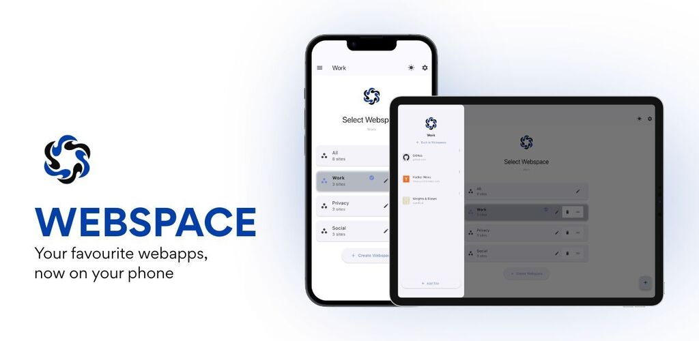
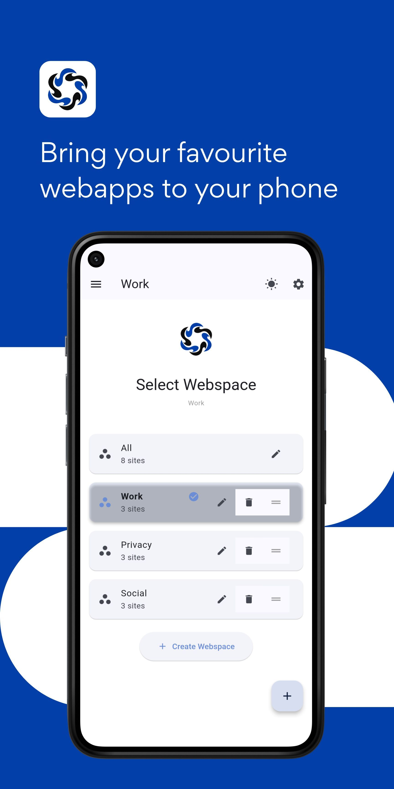
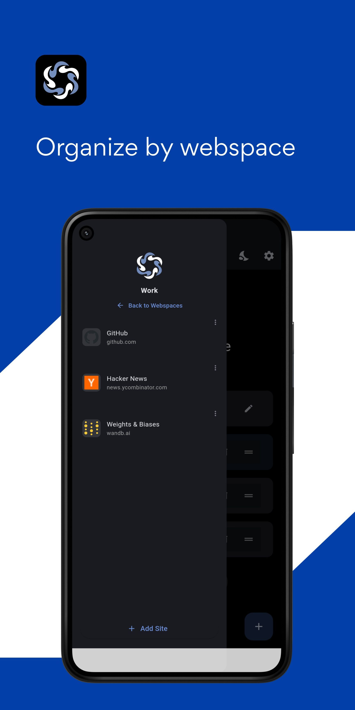
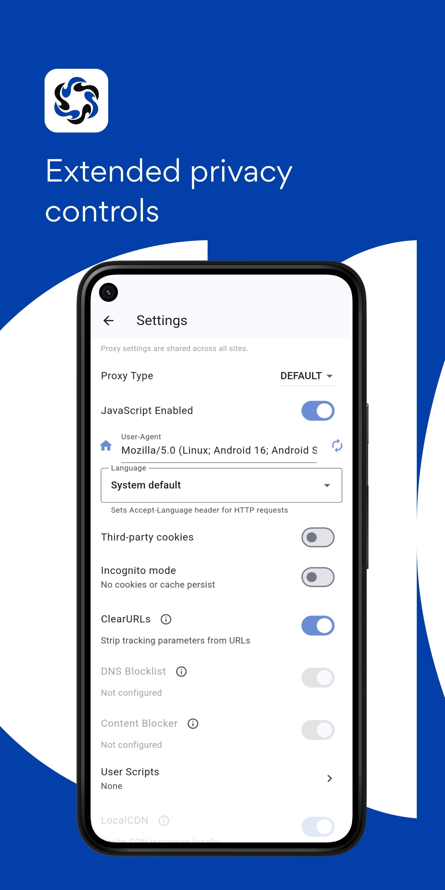
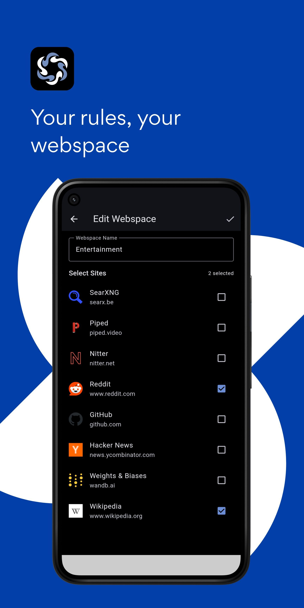

<div align="center">



---

[](https://github.com/theoden8/webspace_app/releases/latest)
[](https://github.com/theoden8/webspace_app/releases)
[](https://github.com/theoden8/webspace_app/actions/workflows/build-and-test.yml)
<a href="https://github.com/sponsors/theoden8">
  
</a>

<a href="https://f-droid.org/packages/org.codeberg.theoden8.webspace">
  
</a>
<a href="https://apps.apple.com/app/webspace-app/id6758049523">
  
</a>
&nbsp;&nbsp;
<a href="https://play.google.com/store/apps/details?id=org.codeberg.theoden8.webspace">
  
</a>

</div>

## Overview

WebSpace is a mobile app that brings all your favorite websites and web apps together in one organized, streamlined interface.

## Screenshots

<p align="center">
  
  
  
  
</p>

**Features**

- 📱 Organize sites into multiple webspaces
- 🔒 Per-site cookie isolation with secure storage
- 🌍 Per-site language preferences (30+ languages)
- 💾 Import/export settings for backup
- 🔄 Proxy support with authentication (Android)
- 🧹 ClearURLs tracking parameter removal
- 🛡️ Hagezi DNS blocklist domain blocking (5 severity levels)
- 🚫 Content blocker with EasyList/EasyPrivacy ad & tracker filtering
- 📦 LocalCDN - cache CDN resources locally to prevent tracking (Android)
- 📌 Home screen shortcuts for quick site access (Android)
- 📜 Per-site user scripts (custom JavaScript injection)
- 🎨 Light/dark mode with accent colors

## Development

### Prerequisites
- [FVM](https://fvm.app/) (Flutter Version Manager)
- Xcode (for iOS/macOS)
- Android Studio (for Android)

### Setup
```bash
git clone https://github.com/theoden8/webspace_app
cd webspace_app

# Install Flutter version via FVM
fvm install

# Get dependencies
fvm flutter pub get
```

## Platform Support

| Platform | Status | Purpose |
|----------|--------|---------|
| iOS | ✅ Supported | Target |
| Android | ✅ Supported | Target |
| macOS | ✅ Supported | Development |
| Linux | 🧪 Development only — WPE WebKit via patched `flutter_inappwebview_linux`. Per-site profiles + per-site proxy via `WebKitNetworkSession`. Requires WPE WebKit ≥ 2.50 (Debian Sid / Trixie+). | Development |

## Tech Stack

- **Framework**: Flutter

This project is made possible by [flutter_inappwebview](https://github.com/pichillilorenzo/flutter_inappwebview), which provides the advanced webview functionality at the core of WebSpace.

URL cleaning is powered by rules from [ClearURLs](https://github.com/ClearURLs/Rules) (LGPL-3.0).

DNS domain blocking uses blocklists from [Hagezi](https://github.com/hagezi/dns-blocklists) (GPL-3.0).

Content blocking uses filter lists from [EasyList](https://easylist.to/) (GPL-3.0 / CC BY-SA 3.0), including EasyList, EasyPrivacy, Fanboy's Social Blocking List, and Fanboy's Annoyance List.

## License

This project is licensed under the [MIT License](LICENSE) - Copyright (c) 2023 Kirill Rodriguez.

**Assets**: Icons and images in the `assets/` directory are licensed under [CC BY-NC-SA 4.0](https://creativecommons.org/licenses/by-nc-sa/4.0/) - Copyright (c) Polina Levchenko. See [assets/LICENSE](assets/LICENSE) for details.
